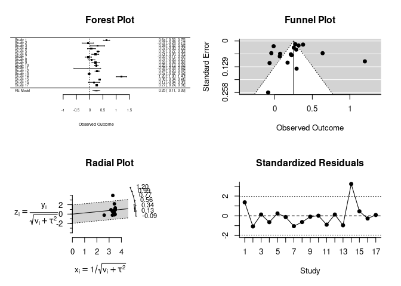

MetaAnalysis Assignment
================
Renée Claes and Maxime Keutgen
2021-04-02

## Introduction

In this notebook, we try to reproduce the Meta-Analysis of Hornsey & al
2016. We start by loading libraries.

``` r
library(haven)
library(metafor)
```

    ## Loading required package: Matrix

    ## Loading 'metafor' package (version 2.4-0). For an overview 
    ## and introduction to the package please type: help(metafor).

``` r
library(tidyverse)
```

    ## ── Attaching packages ─────────────────────────────────────── tidyverse 1.3.0 ──

    ## ✓ ggplot2 3.3.2     ✓ purrr   0.3.4
    ## ✓ tibble  3.0.4     ✓ dplyr   1.0.2
    ## ✓ tidyr   1.1.2     ✓ stringr 1.4.0
    ## ✓ readr   1.4.0     ✓ forcats 0.5.0

    ## ── Conflicts ────────────────────────────────────────── tidyverse_conflicts() ──
    ## x tidyr::expand() masks Matrix::expand()
    ## x dplyr::filter() masks stats::filter()
    ## x dplyr::lag()    masks stats::lag()
    ## x tidyr::pack()   masks Matrix::pack()
    ## x tidyr::unpack() masks Matrix::unpack()

``` r
NEP <- read_sav("NEP.sav")
ObjKnow      <- read_sav("Objective Knowledge.sav")
SubjKnow <- read_sav("Subjective Knowledge.sav")
FreeMark <- read_sav("Support for Free-market Ideology.sav")
TrustScientist <- read_sav("Trust in Scientists.sav")
```

## Objective knowledge

First, we will start with one dataset, objective knowledge. A bit of
datacleaning is required (shortening name of one study).

``` r
ObjKnow[15,1] <- "Hine, D. W., Reser et al (2013)" 
```

Also, we need an estimate of the variance of the effect size. Since
these are correctional studies, the correlations coefficients have been
transformed to Fisher Z scores\(^1\) for inferential purposes. The
correctional coefficient is given by :
\[ r = \frac{cov(X,Y)}{\sigma_X\sigma_Y} \] Fisher transformation is
given by : \[ z = \frac{1}{2} ln \bigg(\frac{1+r}{1-r} \bigg) \] If
\(X_1..X_n\) and \(Y_1,..,Y_n\) are i.i.d paired data, then \(z\) is
asymptotically normally distributed\(^2\) :
\[ z \sim \mathcal{N} \Bigg(\frac{1}{2}ln\bigg(\frac{1+r}{1-r}\bigg),\frac{1}{N-3} \Bigg) \]
We can then compute the variance of the Fisher Z-scores.

``` r
ObjKnow <- ObjKnow %>% mutate(var=1/(ObjKnow$Sample_size-3 ))
```

We now have at our disposal point estimate of the effect size (Z scores)
and of the variance of this effect size. We start by fitting a Random
Effect model (because it is standard and I don’t know what else to do at
this stage).

``` r
REM <- rma(yi = ObjKnow$FishersZ,vi = ObjKnow$var,method = "REML")
```

Let’s look at fancy plots.

``` r
plot.rma.uni(REM)
```

<!-- -->

## References

\[1\] Fisher, R. A. (1915). “Frequency distribution of the values of the
correlation coefficient in samples of an indefinitely large population”.
Biometrika. 10 (4): 507–521. <doi:10.2307/2331838>. hdl:2440/15166.
JSTOR 2331838 \[2\] Fisher, R. A. (1921). “On the ‘probable error’ of a
coefficient of correlation deduced from a small sample” (PDF). Metron.
1: 3–32.
